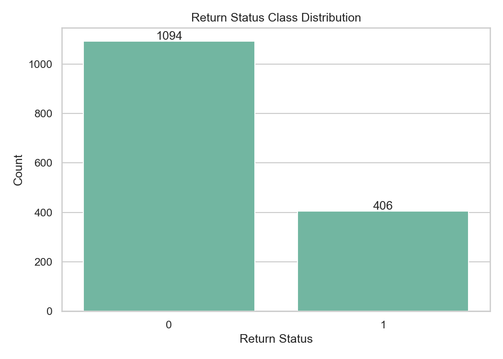
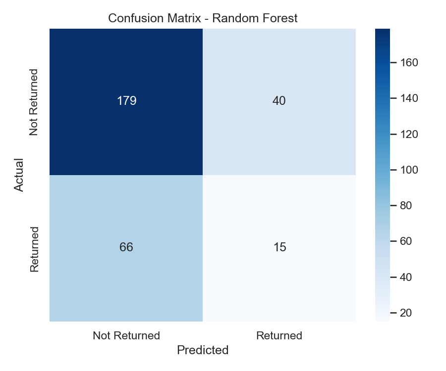

# BLM308 Veri Madenciliği Final Projesi

## Çevrimiçi Alışveriş Ürün İade Tahmini

[](https://www.python.org/)
[](https://scikit-learn.org/)

Bu proje, e-ticaret siparişlerinde ürün iadesinin (`return_status`) makine öğrenmesi ile tahmin edilmesini amaçlar. CRISP-DM metodolojisi, keşifsel veri analizi, beş sınıflandırıcı ve 10 katmanlı stratified çapraz doğrulama kullanılmıştır.

**Öğrenci:** Emre Kaya | **No:** 231041045 | **Ders:** BLM308 Veri Madenciliği

---

## Proje Özeti

| Öğe | Değer |
|-----|-------|
| Veri seti | `product_return_prediction.csv` (1.500 kayıt) |
| Hedef | `return_status` (0: 1.094, 1: 406) |
| Özellikler | `price`, `rating`, `product_id_frequency`, `product_return_rate` |
| En iyi model | Random Forest (CV F1 = 0,3065) |
| Test F1 | 0,2206 (bağımsız test kümesi, tek seferlik) |

---

## Klasör Yapısı

```
.
├── data/
│   ├── raw/                         # Ham CSV
│   └── processed/                   # İşlenmiş veri, split, modeller, JSON metrikler
├── src/
│   ├── preprocess.py                # İnceleme, EDA, ön işleme
│   ├── train_models.py              # Model eğitimi
│   ├── evaluate.py                  # CV + test değerlendirme
│   ├── generate_report.py           # DOCX/PDF rapor
│   ├── generate_presentation.py     # PPTX sunum
│   └── run_all.py                   # Tam pipeline
├── reports/
│   ├── figures/                     # EDA ve değerlendirme grafikleri
│   ├── BLM308_Final_Report.docx
│   ├── BLM308_Final_Report.pdf
│   └── model_comparison.csv
├── presentation/
│   └── BLM308_Final_Presentation.pptx
├── bonus/                           # BLM308 bonus materyalleri
│   ├── report.tex                   # LaTeX rapor kaynağı
│   ├── report.pdf                   # Derlenmiş LaTeX rapor
│   ├── presentation.tex             # Beamer sunum kaynağı
│   ├── presentation.pdf             # Derlenmiş Beamer sunum
│   └── compile.sh                   # LaTeX derleme betiği
├── requirements.txt
└── README.md
```

---

## Kurulum

```bash
git clone <repo-url>
cd "veri madenciligi Final proje"

python3 -m venv .venv
source .venv/bin/activate   # Windows: .venv\Scripts\activate
pip install -r requirements.txt
```

### LaTeX bonus derlemesi (isteğe bağlı)

```bash
# macOS
brew install --cask basictex
export PATH="/Library/TeX/texbin:$PATH"
sudo tlmgr update --self
sudo tlmgr install babel-turkish booktabs

cd bonus
chmod +x compile.sh
./compile.sh
```

Alternatif: Docker ile `bonus/compile.sh` (texlive imajı otomatik kullanılır).

---

## Çalıştırma

### Tam pipeline

```bash
python -m src.run_all
```

### Adım adım

```bash
python -m src.preprocess          # EDA + ön işleme
python -m src.train_models        # 5 model eğitimi
python -m src.evaluate            # 10-fold CV (yalnızca eğitim) + test
python -m src.generate_report     # Türkçe DOCX + PDF rapor
python -m src.generate_presentation
```

### Bonus LaTeX (pipeline sonrası)

```bash
cd bonus && ./compile.sh
```

---

## Modeller

- Decision Tree
- Random Forest
- Logistic Regression
- Naive Bayes
- KNN

## Değerlendirme Metodolojisi

- **CV:** 10-fold Stratified, yalnızca eğitim kümesi (1.200 kayıt)
- **Encoding:** Ürün frekans/iade oranı her CV fold içinde yeniden hesaplanır
- **Test:** 300 kayıt, yalnızca bir kez final değerlendirme
- **Metrikler:** Accuracy, Precision, Recall, F1, ROC-AUC

---

## Sonuçlar

### Çapraz doğrulama (eğitim kümesi)

| Model | Accuracy | Precision | Recall | F1 | ROC-AUC |
|-------|----------|-----------|--------|-----|---------|
| **Random Forest** | 0.6717 | 0.3551 | 0.2734 | **0.3065** | 0.5333 |
| Decision Tree | 0.6275 | 0.2960 | 0.2733 | 0.2822 | 0.5172 |
| Naive Bayes | 0.6633 | 0.3303 | 0.2455 | 0.2791 | 0.5766 |
| KNN | 0.6692 | 0.3299 | 0.2269 | 0.2663 | 0.5199 |
| Logistic Regression | 0.6683 | 0.3270 | 0.2270 | 0.2646 | 0.5713 |

### Final test (Random Forest)

| Metrik | Değer |
|--------|-------|
| Accuracy | 0.6467 |
| Precision | 0.2727 |
| Recall | 0.1852 |
| F1 | 0.2206 |
| ROC-AUC | 0.4793 |

Confusion matrix: TN=179, FP=40, FN=66, TP=15

---

## Ekran Görüntüleri / Grafikler

Pipeline çalıştırıldıktan sonra `reports/figures/` altında üretilen grafikler:

| Grafik | Dosya |
|--------|-------|
| Sınıf dağılımı | `reports/figures/01_class_distribution.png` |
| Fiyat vs iade | `reports/figures/03_price_vs_return.png` |
| Puan dağılımı | `reports/figures/05_rating_distribution.png` |
| Korelasyon | `reports/figures/07_correlation_heatmap.png` |
| Confusion matrix | `reports/figures/08_confusion_matrix_best_model.png` |
| ROC eğrisi | `reports/figures/09_roc_curve_best_model.png` |
| Feature importance | `reports/figures/10_feature_importance_random_forest.png` |





---

## Çıktı Dosyaları

| Tür | Konum |
|-----|-------|
| Rapor (Word) | `reports/BLM308_Final_Report.docx` |
| Rapor (PDF) | `reports/BLM308_Final_Report.pdf` |
| Sunum (PPTX) | `presentation/BLM308_Final_Presentation.pptx` |
| LaTeX rapor | `bonus/report.pdf` |
| LaTeX sunum | `bonus/presentation.pdf` |
| Metrikler | `data/processed/evaluation_results.json` |

---

## Yapay Zeka Kullanım Beyanı

Proje yapılırken yapay zeka araçlarından yararlanılmıştır.

---

## Lisans

Bu proje BLM308 Veri Madenciliği dersi kapsamında akademik amaçla hazırlanmıştır.
